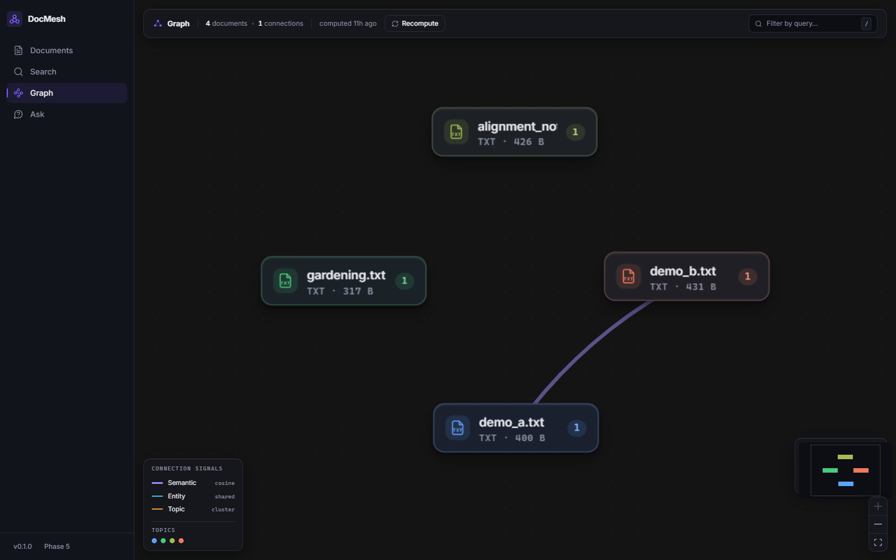
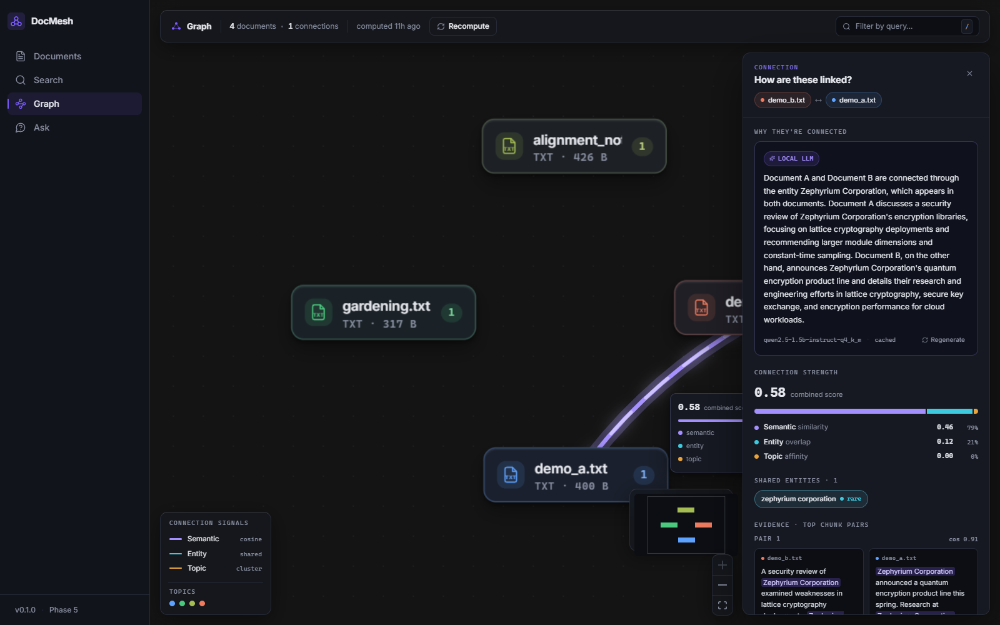
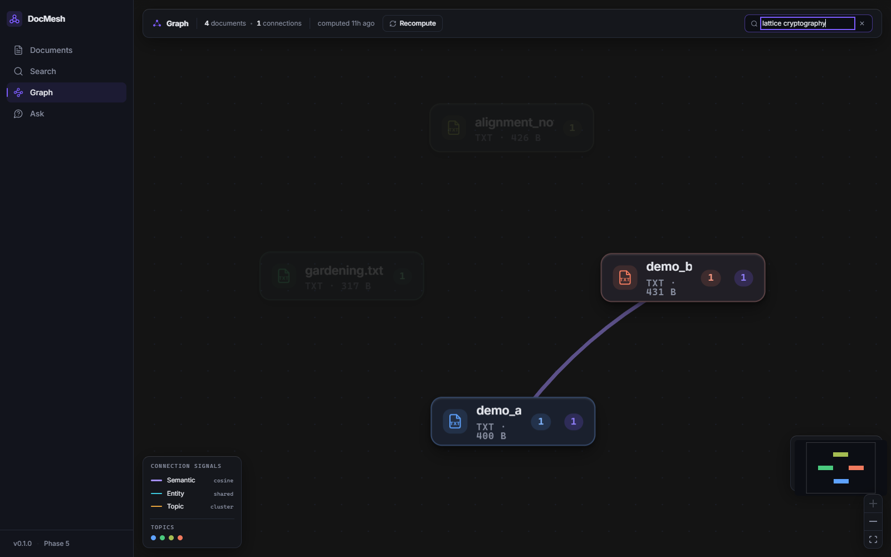
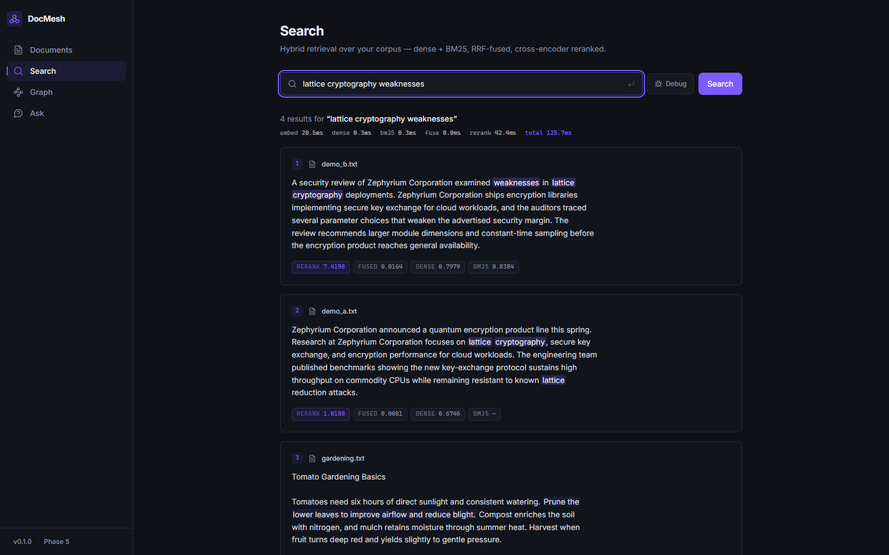
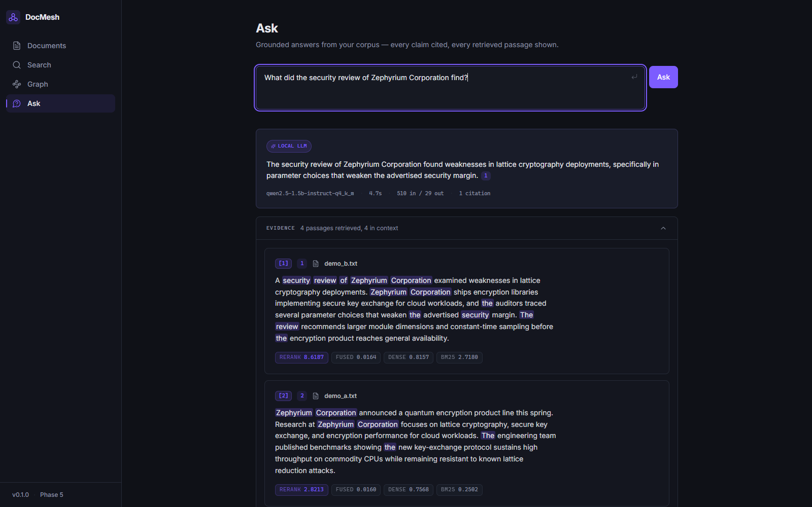
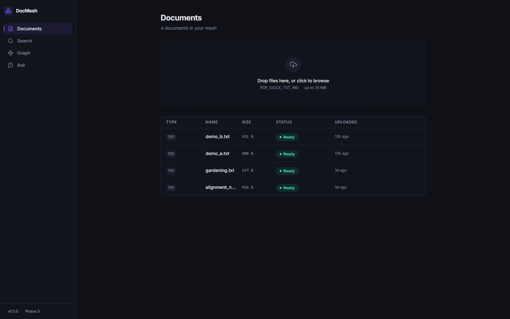

# DocMesh

**Semantic document intelligence, built from primitives — fully local, no API keys.**

Upload a pile of documents and DocMesh turns them into something you can *interrogate*:
hybrid semantic + keyword search, an automatically inferred connection graph explaining
*how* your documents relate, and grounded question-answering with verified citations —
all without LangChain, LlamaIndex, or any external LLM API. Every layer (chunking,
embedding, retrieval fusion, reranking, graph inference, generation) is hand-built,
runs on CPU, and never sends a byte of your corpus off the machine.

> Portfolio project by an MTech Information & Cyber Security student. Uploads are treated
> as hostile input (streamed size caps, magic-byte sniffing, zip-bomb guards, filename
> sanitization), retrieved document text is treated as untrusted prompt input (fenced,
> demoted, citations verified post-hoc), and the whole stack is offline by design.
> [ARCHITECTURE.md](./ARCHITECTURE.md) documents the threat model and all 28 design
> decisions.



## Features

**Connection graph** — the centerpiece. On every ingestion, documents are pairwise scored
by three independent signals: semantic overlap (mean of top-k *cross-document chunk*
similarities — not doc-embedding cosine), shared entities weighted by smoothed IDF
(a shared rare "DINOv3" ≫ a shared common "Microsoft"), and NMF topic distributions
compared by Jensen-Shannon divergence. Edges above threshold render as a force-directed
graph (react-flow + d3-force); clicking one opens the evidence: a local-LLM explanation,
shared-entity chips, and the actual overlapping chunk pairs side by side.



**Query-scoped subgraph** — type a query and the graph live-filters: irrelevant nodes
fade to 15%, the relevant subgraph stays lit with per-document match-count badges.
Relevance is calibrated max chunk cosine, computed server-side with the same calibration
as edge scores.



**Hybrid search** — dense (bge-small in FAISS) + sparse (BM25) fused with Reciprocal
Rank Fusion, then reranked by a cross-encoder. Every hit shows all four scores; a debug
toggle exposes the raw dense/BM25 rankings to demo *why* hybrid beats either alone.
Warm query: **~126 ms** end to end (embed 21 / dense 0.3 / bm25 0.3 / fuse 0.04 /
rerank 42 ms).



**Ask-the-Corpus** — grounded QA over the same retrieval pipeline. The local model
answers *only* from numbered context passages and cites inline; every `[n]` the model
emits is **verified against the actual retrieved set** (hallucinated markers are
stripped), and the full evidence panel is never hidden. Warm answer: **~3.4 s**
(0.55 s retrieval + 2.9 s generation).



**Hostile-upload ingestion** — drag-and-drop PDF/DOCX/TXT/MD with live per-stage status
over SSE (parsing → chunking → embedding → indexing). Content-Type and Content-Length
are treated as attacker claims: magic bytes are sniffed from disk, size caps enforced
during streaming, filenames never touch the filesystem (files are stored as
`{uuid}.{ext}`), DOCX archives are checked for zip bombs, and duplicates are rejected
by SHA-256.



## The local LLM

All generative text comes from **Qwen2.5-1.5B-Instruct** (GGUF Q4_K_M, ~1 GB) running
in-process via llama-cpp-python — lazy-loaded on first use, auto-downloaded to
`data/models/`, one generation at a time behind a lock, token-bucket rate-limited
(the scarce resource is your CPU). If the model is absent or unavailable, everything
degrades gracefully: edge explanations fall back to a deterministic template and Ask
returns the retrieved evidence with an honest "LLM unavailable" flag — never a 500,
never a hidden failure. Swapping in a bigger GGUF is one env var.

## Stack

- **Backend** — FastAPI · Pydantic v2 · SQLAlchemy 2.0 Core (not ORM) · Alembic ·
  SQLite (WAL) · FAISS (`IndexFlatIP`, exact) · rank-bm25 · sentence-transformers
  (bge-small-en-v1.5 + ms-marco cross-encoder) · spaCy NER · scikit-learn NMF ·
  llama-cpp-python · structlog
- **Frontend** — React 19 · Vite 6 · Tailwind v4 · TanStack Query · @xyflow/react +
  d3-force · framer-motion · TypeScript strict
- **Patterns** — repository pattern over Core (SQLite→Postgres is a URL change),
  `VectorStore` interface (FAISS→Pinecone is one class), `LLMClient` interface
  (local→remote is one class), DI via FastAPI, all models lazy singletons

## Quickstart

### Backend

```powershell
cd backend
python -m venv .venv
.venv\Scripts\activate        # PowerShell; use `source .venv/bin/activate` on Unix
pip install -r requirements.txt -r requirements-dev.txt
uvicorn app.main:app --reload  # migrations run automatically on startup
```

API at http://localhost:8000 — try `GET /api/health`. Interactive docs at `/docs`.
First search downloads the embedding models (~130 MB); the first edge explanation or
question downloads the Qwen GGUF (~1 GB). Both cache under `data/` and never repeat.

### Frontend

```powershell
cd frontend
npm install
npm run dev
```

UI at http://localhost:5173 (dev server proxies `/api` to the backend).

### Docker

```powershell
docker compose up --build
```

Frontend on http://localhost:5173, backend on http://localhost:8000; DB, uploads,
vector index, and all model caches persist in `./data`. The backend image installs
CPU-only torch and llama-cpp wheels (no CUDA, no compiler). *Honesty note: the compose
setup is written and reviewed but was not runtime-verified on the development machine
(no Docker daemon available) — the native quickstart above is the verified path.*

### Tests

```powershell
cd backend && pytest            # 161 fast tests, no model downloads (fake models)
cd backend && pytest -m slow    # 4 tests against the REAL models (downloads ~1.1 GB)
cd frontend && npx vitest run   # 17 tests
```

## Real numbers (measured on a laptop CPU, Windows 11)

| Operation | Latency |
|---|---|
| Ingest a document end-to-end (parse → chunk → embed → index) | ~450 ms |
| Hybrid search, warm (embed + FAISS + BM25 + RRF + rerank) | ~126 ms |
| Full 3-signal graph recompute (entities + topics + scoring) | ~135 ms |
| Edge explanation, local LLM, warm | ~3–7 s (then cached) |
| Grounded answer, warm (retrieval + generation) | ~3.4 s |

## Project phases

| Phase | Scope | Status |
|-------|-------|--------|
| 1 | Scaffold: hostile-upload pipeline, document CRUD, polished shell UI | ✅ |
| 2 | Hybrid retrieval: extraction, chunking, FAISS + BM25 + RRF + rerank, SSE | ✅ |
| 3 | Connection graph: semantic + entity + topic signals, edges in DB | ✅ |
| 4 | Graph UI (react-flow + d3-force) + local-LLM edge explanations | ✅ |
| 5 | Query-scoped subgraph + Ask-the-Corpus with verified citations | ✅ |
| 6 | Docs, screenshots, docker, final polish | ✅ |

## License

MIT — see [LICENSE](./LICENSE).
